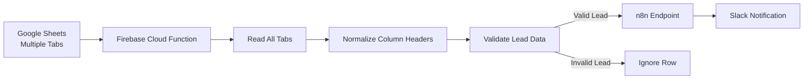
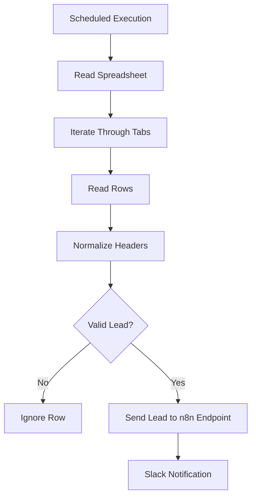

# Firebase Automation — Google Sheets Leads to Slack

## Overview

This automation monitors a Google Sheets document containing marketing leads and sends notifications to Slack whenever a new lead is detected.

The spreadsheet contains **multiple tabs**, each representing a different lead source. Because new tabs may be added over time, the automation is designed to dynamically scan all tabs instead of listening to a single sheet.

The automation is implemented using **Firebase Cloud Functions**, which periodically read the spreadsheet and process new leads.

---

## System Architecture



The Firebase function scans the spreadsheet and sends valid leads to Slack through an n8n endpoint.

---

## Components

### Google Sheets

The Google Sheets document stores incoming leads.  

Key characteristics:

- Multiple tabs
- Each tab represents a lead source
- Each row corresponds to a lead

Typical fields include:

- ID
- Create Time
- Ad Name
- Form Name
- Platform
- Email
- Phone Number
- Company Name
- Lead Status

Because column names may vary slightly across tabs, the automation performs **header normalization** before validating data.

---

### Firebase Cloud Function

The automation logic is implemented as a **Firebase Cloud Function**.

Responsibilities:

- Scan the spreadsheet
- Read all tabs
- Detect new rows
- Normalize column headers
- Validate lead structure
- Send valid leads to Slack

The function runs using a **scheduled trigger**.

---

## Execution Flow



---

## Execution Schedule

Because Google Sheets does not provide native triggers for new rows in Firebase, the automation runs on a schedule.

Execution frequency:

```
Every 3 minutes
```

During each execution cycle:

1. All spreadsheet tabs are read.
2. Rows are validated.
3. Eligible leads are processed.

---

## Lead Validation Rules

A row is considered valid when:

- Required lead fields are present
- The row contains meaningful data
- The row has not already been processed

Rows that do not meet these conditions are ignored.

---

## Integration with n8n

The Firebase function does not send Slack messages directly.

Instead, it calls an **n8n endpoint**, which handles the Slack integration.

Responsibilities of n8n:

- Receive lead data
- Format the Slack message
- Send the notification to the appropriate Slack channel

This separation allows Slack messaging logic to remain centralized in n8n.

---

## Environment Configuration

Environment variables are stored in:

```
.env
.env.example
```

Typical variables include:

- Google Sheets API credentials
- Spreadsheet ID
- n8n endpoint URL

Sensitive information should never be committed to the repository.

---

## Deployment

The automation is deployed using **Firebase Cloud Functions**.

Typical deployment steps:

1. Install dependencies
2. Configure environment variables
3. Deploy the function using Firebase CLI

Example:

```
firebase deploy --only functions
```

---

## Maintenance Notes

When maintaining this automation:

- Ensure new tabs follow the expected lead structure.
- Verify that column headers remain compatible with the normalization logic.
- Monitor execution logs in Firebase for errors.
- Confirm Slack notifications are received through the n8n workflow.

---

## Future Improvements

Possible enhancements include:

- Event-based triggers instead of scheduled polling
- Improved validation rules
- Monitoring and alerting for failed notifications
- Performance optimization for large spreadsheets
