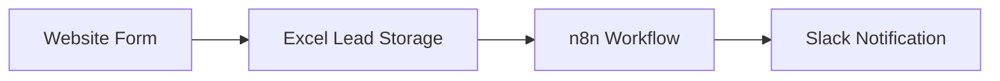

# Excel Leads → Slack Sync

## Overview

This automation synchronizes leads submitted through the website form and sends them to Slack for visibility by the marketing team.

The workflow retrieves new entries stored in an Excel file and posts them to a Slack channel.

---

## System Flow

Website Form  
↓  
Excel (lead storage)  
↓  
n8n Workflow  
↓  
Slack Channel Notification

---

## Automation Platform

n8n

---

## Purpose

Ensure that every lead submitted through the website form is automatically shared with the marketing team through Slack.

This avoids manual monitoring of the Excel file and allows the team to react quickly to new leads.

---

## Key Components

### Data Source
Website form submissions stored in an Excel sheet.

### Processing
n8n retrieves records from the Excel file.

### Filtering
A date filter is applied to ensure that only new records are processed.

### Notification
Valid records are sent to a Slack channel.

---

## Issue Observed

Some leads were not being synchronized correctly.

The workflow returned **18 records that had not been processed** since the previous week.

---

## Actions Taken

1. Reviewed the n8n workflow.
2. Identified records not processed previously.
3. Added a filter based on the `createTime` field.
4. Normalized the date format.
5. Reprocessed the records.

---

## Result

The workflow correctly filtered the records and sent the valid leads to Slack.

---

## Notes

This automation belongs to the **Marketing automations group**.

Future improvements may include standardizing workflow naming conventions.
