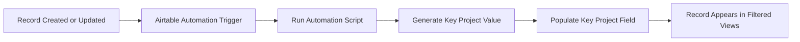
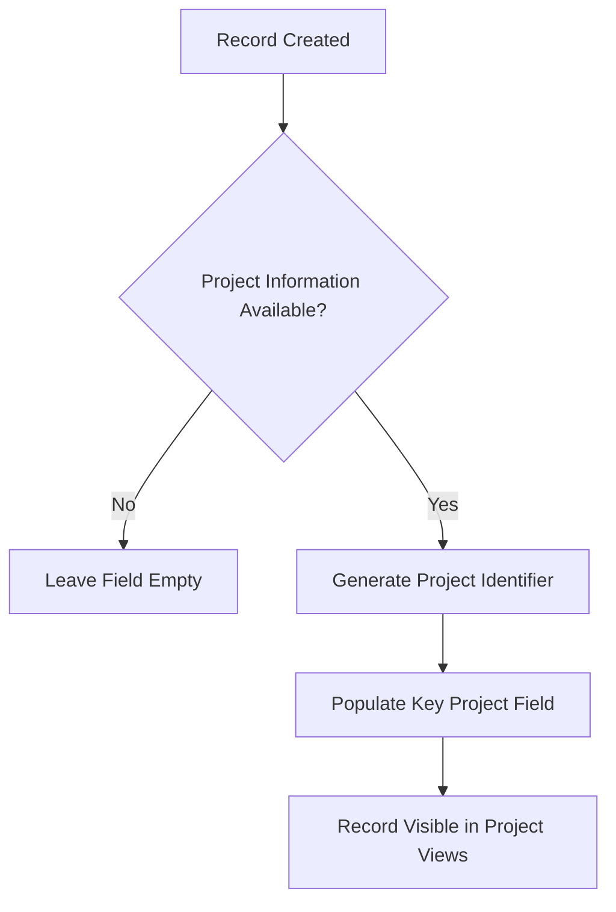

# Airtable Automation — Key Project Population

## Overview

An issue was reported where the **Key Project field** was not being automatically populated for certain records in Airtable.

This field is critical because it is used to associate records with their corresponding project and enables filtered views within the platform.

The automation was reviewed and adjusted to ensure that when a record is created or updated, the **Key Project field is automatically populated using the appropriate script logic**.

---

## System Context

In the platform, project-based views depend on a specific **Key Project identifier**.

These identifiers are used to filter and display records related to specific projects such as:

- Healthcare Projects
- Metal Projects
- Recruitment Projects
- Other internal initiatives

If the **Key Project field is empty**, the record will not appear in the correct filtered views.

---

## System Architecture



The automation ensures that records are correctly associated with their corresponding project.

---

## Problem

Some records were appearing without a **Key Project value**, which caused several issues:

- Records were missing from project-specific views.
- Users could not easily identify which project a record belonged to.
- Certain internal dashboards were not displaying the expected data.

During the support session, the automation responsible for populating this field was reviewed.

---

## Solution

A new automation configuration was implemented to ensure that the **Key Project field is always populated when a record is created or updated**.

The automation performs the following steps:

1. Detect when a record is created or modified.
2. Execute a script that determines the corresponding project.
3. Generate the correct **Key Project identifier**.
4. Update the record with the generated value.

---

## Automation Trigger

The automation is configured to run when:

```
A record is created
OR
A relevant field is updated
```

This ensures that the **Key Project value remains synchronized** with the record data.

---

## Key Project Logic



The automation verifies that the necessary project information exists before assigning the value.

---

## Testing

The automation was tested using Airtable's **Test Automation** feature.

The following validations were performed:

- Script execution triggered correctly.
- Key Project values were generated.
- Records appeared correctly in filtered project views.

---

## Observations

During the review process, several additional findings were identified:

- Some automations were referencing outdated fields.
- Certain automations were disabled.
- Some scripts contained legacy logic that may no longer be required.

These issues will be reviewed in future cleanup tasks.

---

## Current Status

Automation successfully configured.

Further monitoring will confirm that new records are consistently receiving the correct **Key Project value**.

---

## Time Spent
0.5 hour
