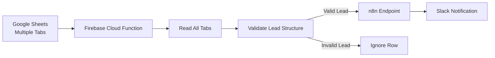
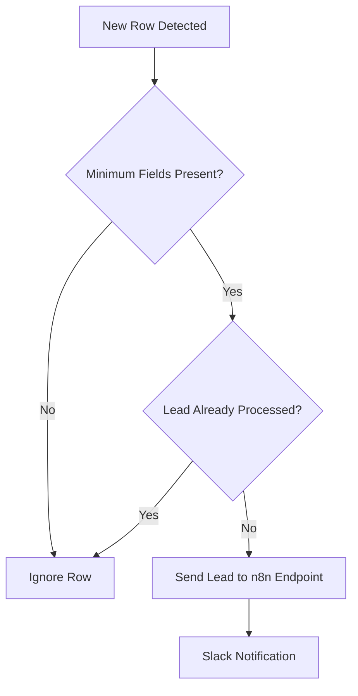

# Google Sheets Leads → Slack Notification (Firebase)

## Overview

The marketing team collects leads through a **Google Sheets document** containing multiple tabs. Each tab represents a different lead source.

The objective of this automation is to automatically notify the marketing team in **Slack** whenever a new lead is added.

Previously, this process relied on **n8n automations**, but this solution was not scalable because each automation could only monitor a single sheet tab.

To solve this limitation, a new automation will be implemented using **Firebase Cloud Functions**, allowing the system to monitor all tabs dynamically.

---

## System Architecture



The Firebase function periodically scans the spreadsheet, validates lead data, and sends valid leads to Slack through an n8n endpoint.

---

## Problem

The previous solution used **n8n workflows** to detect new leads.

However, this approach had several limitations:

- n8n can only listen to **one specific tab** at a time.
- If a new tab is created in the spreadsheet, the automation will not detect it.
- Managing multiple workflows becomes difficult over time.
- Some Slack messages were arriving empty due to inconsistent column names.

Because of these limitations, **n8n is not suitable for monitoring the entire spreadsheet dynamically**.

---

## Solution

A centralized automation will be implemented using **Firebase Cloud Functions**.

Instead of listening to individual tabs, the Cloud Function will periodically scan the Google Sheet and detect new rows across **all tabs**.

When a valid lead is detected, the system will send the lead information to Slack through an existing **n8n endpoint** responsible for publishing messages.

---

## Execution Strategy

Google Sheets does not provide a native trigger for detecting new rows in Firebase.

For this reason, the automation will run using a **scheduled execution**.

Execution frequency:

```
Every 3 minutes
```

During each execution, the function will:

1. Read all tabs from the spreadsheet.
2. Detect newly added rows.
3. Validate the lead structure.
4. Send eligible leads to Slack.

---

## Lead Structure

Each row in the spreadsheet represents a lead and typically contains fields such as:

- ID
- Create Time
- Ad Name
- Form Name
- Platform
- Email
- Phone Number
- Company Name
- Lead Status

Because column names may vary between tabs, the automation will **normalize column headers** before validating the lead data.

---

## Lead Validation Logic



Only rows that contain the required lead information and have not been processed previously will trigger notifications.

---

## Status Handling

To avoid sending duplicate notifications, the automation will track the processing status of each row.

Possible status values:

```
pending
sent
error
```

Processing logic:

If the Slack message is sent successfully:

```
status = sent
```

If sending fails:

- The system will retry up to **3 times**
- After the maximum retries, the row will be marked as **error**

---

## Firebase Implementation

The automation will be implemented using:

- Firebase Cloud Functions
- Google Sheets API
- Scheduled execution (cron job)

Environment variables will be managed using:

```
.env
.env.example
```

Sensitive credentials will **not be stored in the repository**.

---

## Current Status

- Architecture defined
- Initial project structure generated
- Implementation pending

---

## Next Steps

1. Implement the Firebase Cloud Function.
2. Configure environment variables.
3. Connect to the Google Sheets API.
4. Deploy the function to Firebase.
5. Integrate the automation with the n8n Slack endpoint.
6. Validate that new leads from any tab trigger Slack notifications correctly.

## Time Spent

1.5 hours
